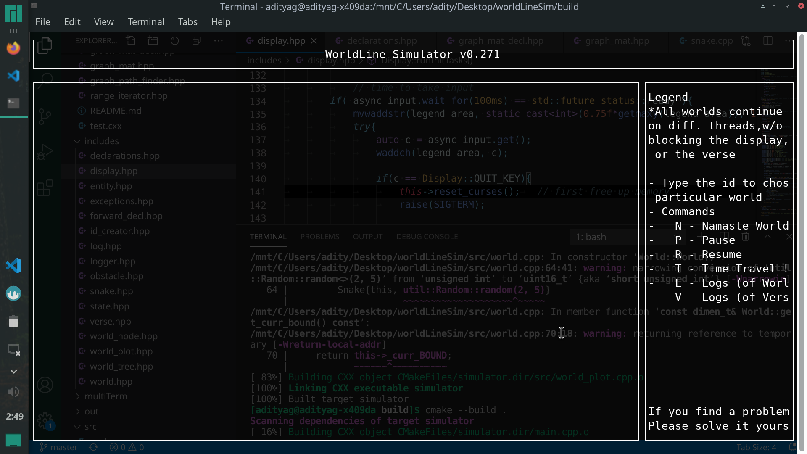

## Curses Display

This is a C++ wrapper, providing RAII classes wrappers over the curses library.
It was originally a part of my [WorldLine Simulation project](https://github.com/adi-g15/worldLineSim), so it in by itself is very small as of now.

> I don't recommend you to use this as of now, in its current state. Though if you want to use/experiment, it's fairly simple to use in original form or even modify as per your liking

## Usage

Just link with the `CURSES_DISP` target built by CMake, it is a static library.

* It provides you with a `Display`, `SubWindow` and a `node_adapter` class.
* The Display being the first class you should instantiate, then SubWindow is a wrapper over WINDOW* which is inside another SubWindow or WINDOW*, though for most use cases, you will interact with adapters inherited from node_adapter.
* node_adapter is meant to be inherited from, and provides the data to be shown on screen, as of now, you can have 8 node_adapters being displayed on the screen, each represented as a box.
* Each subwindow provides `printf`, `add_str` (can pass alignment too), `box`, and more member functions to insert horizontal lines, updating display etc.

:copyright: Aditya Gupta 2021
